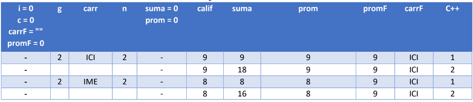

Ejercicio 3 Semana 2:
Se desea saber que grupo de primeros obtuvo el mejor promedio, cada grupo puede tener distinta
cantidad de alumnos. Al final diga de que carrera es y el promedio que obtuvo cada uno y el mayor.

