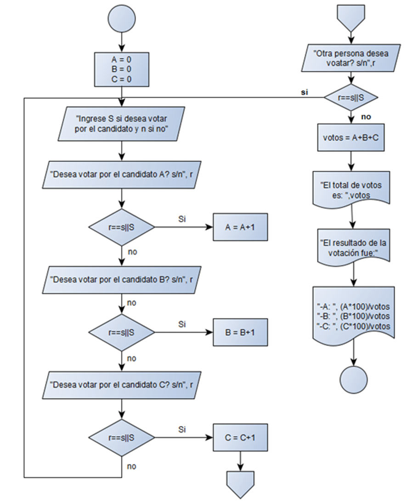
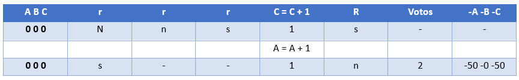

Ejercicio 3 Semana 1: Se realizó una encuesta de 3 candidatos a la presidencia municipal de colima, Se le preguntó a N personas su preferencia electoral. Se desea conocer el resultado de la encuesta.

