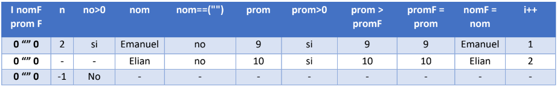

Ejercicio 1 Semana 2:
La Fime quiere dar una beca a su mejor estudiante, para eso le pregunto sus 6 calificaciones y su nombre, son n alumnos digan el nombre y el promedio del alumno que debe recibir la beca

